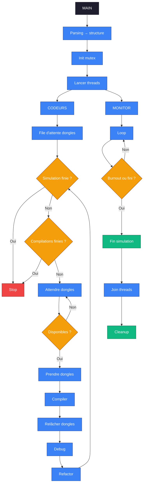

*This project has been created as part
of the 42 curriculum by tmalpert*

# Codexion
## Description
### Project Overview

Codexion is a **multithreading** project whose goal is to simulate the simultaneous execution of multiple “coders” working on different tasks (compiling, debugging, refactoring).

To compile, each coder must acquire two dongles and hold them for the entire compilation phase. These dongles are shared between coders in such a way that each coder shares their two dongles with their immediate neighbors.

Each coder is represented by a **thread**, allowing us to reproduce a concurrent environment where multiple actions occur in parallel.

This project demonstrates fundamental concepts of **concurrent programming** in C, using the ```pthread``` library.

### What is Multithreading?

Multithreading consists of executing multiple parts of a program at the same time.
Unlike a classic (sequential) program:

```
Task 1 → Task 2 → Task 3
```

With threads:
```
Task 1
Task 2   → executed in parallel
Task 3
```
Each thread has:
- its own execution flow
- but shares the same memory space

### What is a thread? 

A thread is a sub-part of a process, i.e., an execution unit within a program.
A process is a program in execution.
The CPU, composed of multiple cores, executes processes and their threads by distributing and switching between them across cores.
Common Multithreading Issues
<br>
<br>

If not handled properly, multithreading can lead to:
- Race Conditions: <br>
A race condition occurs when multiple threads access and modify the same data simultaneously without proper synchronization.
Result: unpredictable behavior and hard-to-reproduce bugs.

- Deadlocks: <br>
A deadlock occurs when two (or more) threads are waiting for resources held by each other.
Result: the program becomes completely stuck.

Execution Diagram

Below is a simplified diagram of the program execution:


## Instructions

To use the project:

**1/ Clone the repository:**
```
git clone <repository_url>
```
**2/ Build the project:**
```
make
or
make all
```

Available Makefile commands:

- ```make clean``` → remove object (.o) and dependency (.d) files
- ```make fclean``` → remove object, dependency files and the executable
- ```make re``` → full rebuild (fclean + all)

**3/ Usage**

After building, an executable named ```codexion``` will be created.

Run it with the following arguments:

```shell
./codexion number_of_coders time_to_burnout time_to_compile time_to_debug time_to_refactor number_of_compiles_required dongle_cooldown scheduler
```
Example:
```shell
./codexion 10 200 10 10 10 5 10 edf
```
Output Format
```
<time_from_start_in_ms> <coder_id> <action>
```
## Resources
### Allowed Functions:
 - pthread_create
 - pthread_join
 - pthread_mutex_init
 - pthread_mutex_lock
 - pthread_mutex_unlock
 - gettimeofday
 - usleep
 - malloc
 - free
 - printf
 - fprintf
 - strcmp
 - atoi

### online resource:
- IA 
- [man](https://man7.org/linux/man-pages/index.html)<br>
- [How to use pthread](https://perso.ens-lyon.fr/francois.schwarzentruber/teaching/l3-prog/book/c_thread.html)


## Disclaimer
1/ During this project, I used AI tools primarily to help me understand multithreading functions, as well as to translate and edit certain sections of the README. 

2/ This project was carried out as part of the core curriculum at 42 school. It is not intended to be perfect, but rather to illustrate my level and progress at this stage of my journey at 42 school.